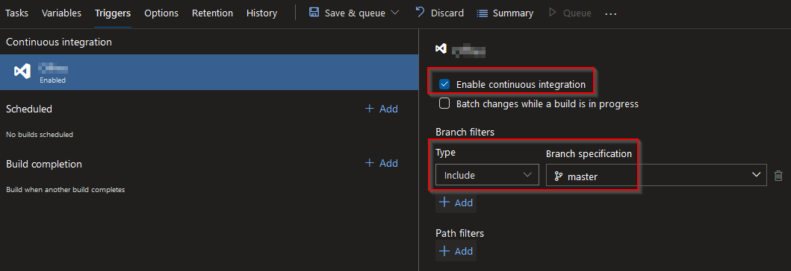
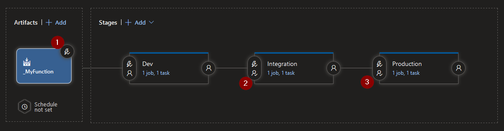
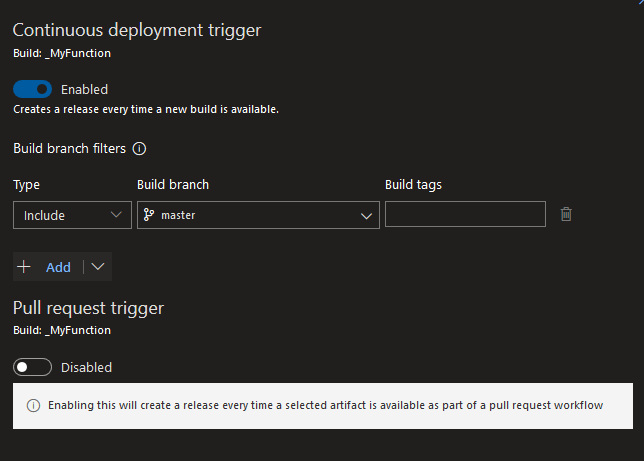

# 1. Explain in few lines your migration strategy, what will be the steps & what will be the risks to consider?
The major risk would be the function not working when the migration is done so the first thing to establish is a rollback plan to be able to revert the change back to the old configuration quickly. 

Here are the steps I would do to migrate : 
1. Deploy new Infrastructure to dev environment
2. Deploy Function Code to dev environment
3. Test/Validate dev environment
4. Deploy new Infrastructure to integration and production environment
5. Deploy Function Code to integration and production environment
6. Test/Validate integration and production environment
7. Create dashboard and alerts on all environments
8. Stress test the function to validate the fact that it will be able to support high load
9. Intentionnaly break the function to see if the alert are triggered
10. Communicate to everybody (Customer Care, Dev, Ops, ...) that the migration is imminent
10. Edit the DNS records to switch the resolution to the new architecture
11. Check all the metrics to ensure everything is OK
12. Closely Monitor the function during the next few days
13. Have a drink to celebrate :)

# 2. Create the configuration file or describe the steps with your favorite CI tool (Azure DevOps will be a plus) that create the package from any commit into the master branch.
In Azure Devops, I would create a "Build" pipeline to compile the code and produce an artifact that will be used by a "Release" pipeline. 
With this configuration, the build will be triggered everytime a commit is made to the master branch : 

# 3. Create the YML or describe the steps to automatically deploy the Azure Function into different environments (Staging then Prod).
The release Pipeline could look something like this : 

    1. Here we configure the Continuous Deployment to automatically deploy to the Dev environment everytime a new build is available for the Master Branch : 

    2. and 3. I'd add approvers for the Integration and Production environment to avoid some code going to production too soon. 

In each stage I would use the built-in task "_Azure Function App Deploy_" to deploy (maybe using Task Groups to make it easy to edit all the stages at once)

> NB : Another way to compile and deploy the Function could be to use "Pipelines" and "Environments" method where build and deploy are done in the same pipeline. 

> NB : Another way to deploy could be by using Slots to deploy to a staging slot first and then switch it with the production Slot to avoid potentials downtimes. 

# 4. Create a tiny-file that will create all cloud resources in an Infrastructure As Code way.
## Terraform files
See the [terraform](terraform) folder. 

## Terraform deployment
To deploy the infrastructure using Azure Devops I would use the "Pipelines" and "Environments" method. 

The pipeline would have the following Stages : 
- \[DEV\] Terraform Plan (that will be triggered on a commit on any branch to facilitate debugging)
- \[DEV\] Terraform Apply
- \[INTEGRATION\] Terraform Plan (that will be triggered on a commit on master branch only)
- \[INTEGRATION\] Terraform Apply
- \[PRODUCTION\] Terraform Plan (that will be triggered on a commit on master branch only)
- \[PRODUCTION\] Terraform Apply

The idea behind splitting Terraform Plan and Apply is to be able to see what is going to be changed during the Apply stage before it's too late (I've seen Terraform behaving strangely with some resource). In order for the Apply stage not to be launched automatically, I would add reviewers for all of them. 

## Terraform Plan Stage
Here are the steps for the "Terraform Plan" Stage : 
- Prepare Terraform Storage : This step creates a storage account and a container in it (if they don't already exists)
- Replace tokens in *.tf Files : This step is used to replace tokens in the tf files (azurerm version, location, environment name, ...)
- Install Terraform
- Terraform Init : Using backend file on storage in order to store the tfstate file in the container created previously
- Terraform Validate
- Terraform Plan
- Copy Files to publish
- Publish pipeline artifact

## Terraform Apply Stage
Here are the steps for the "Terraform Apply" Stage : 
- Install Terraform
- Download Pipeline Artifact
- Terraform Init
- Terraform Apply
- Push output in variable group
- Lock all azure resources (only in the Production environment, to avoid "fat fingers" delete)

## Variables groups
I'll also have to create 3 variables groups by environment : 
- \<projectname\>-\<env\>-terraform-autofilled : Contains all the elements from the terraform outputs (connection string to storage account, public ip, url, ...)
- \<projectname\>-\<env\>-terraform : Contains all the variables that will be used by terraform when deploying infrastructure (subscription id, environment name, ...)
- \<projectname\>-\<env\>-application : Contains all the information needed by the application to run (connection strings to database, application settings that are linked to the environment)

And 2 globals variable groups that contains all the information that will be the same between all the environment : 
- \<projectname\>-terraform-global
- \<projectname\>-application-global

# 5. Describe how you will secure all secret information & password during the deployment process.
I see two ways of doing it : 
    1. Storing all sensible informations in an Azure Devops Variable Group with the "secret" type. 
    2. Storing all sensible informations in an Azure keyvault and configure Azure Devops to retrieve it. 

# 6. Describe how you will add monitoring & alerting with which tool.
## Dashboarding
First I would start by creating an Azure Dashboard with some basics graphs like "Failed Requests", "Server response time", "Server Requests" and share it with the developpers. 
## Alerting
Then I'd create some alert rules for the function based on HTTP status code 5xx, 4xx and Response Time. 
## Monitoring
If needed, I could create a Powershell Script to test if the Azure Function is working as intented from a monitoring application (Centreon, Nagios, ...)
## Logging
Meanwhile, the function should send the logs to an application like Splunk or ELK in order to centralize and facilitate the cross-checking of information. 

# 7. During the deployment, you need to stop a Windows Service before the deployment and restart it after. Could you provide the script that will do that?
See [Invoke-WindowsService.ps1](Invoke-WindowsService.ps1) file. 
For this one I assume that the user that will launch the script (probably the user that runs the azure devops agent) have the rights to remotely connect to the server. 
If not, I'll add a Credential parameter to the script and launch the commands remotely via the Invoke-Command Cmdlet. 

# 8. BONUS ? What will be the changes if we dockerize the microservice?
I've never worked on Container (even thought I understand the very basics of it) so I won't be able to answer the question unless I copy/paste some articles found on the Internet which would not be very interesting for you or me. 

# 9. BONUS ? What will be the changes if we deploy the code into AKS (or in a Kubernetes environment)?
Same as question 8
